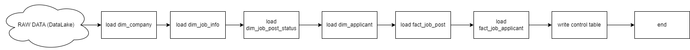
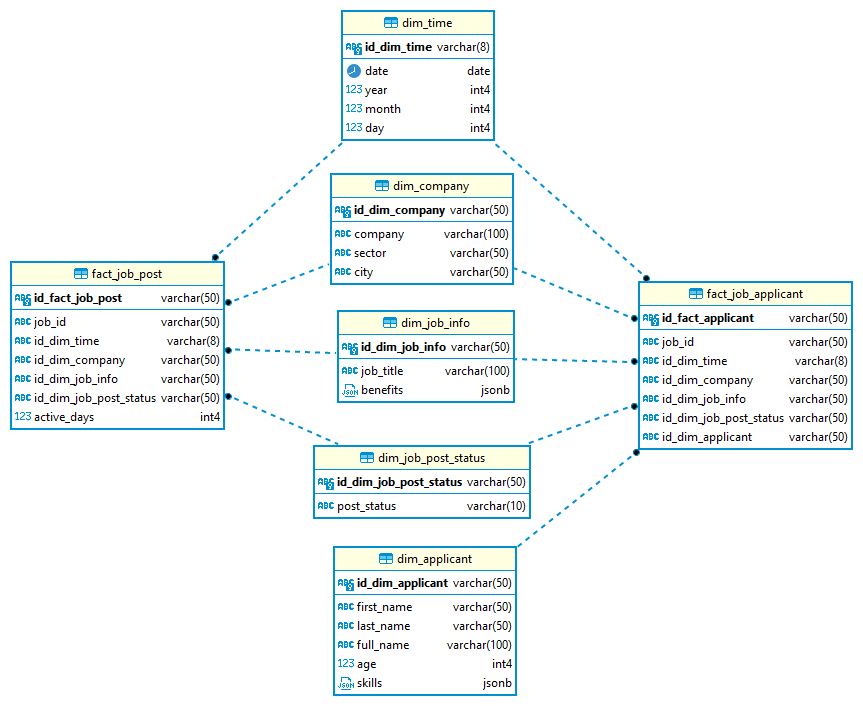
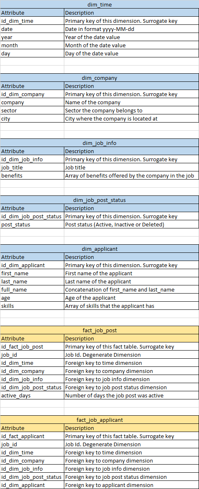

# Tecoloco Test for Data Engineer
* Date: June 3rd 2023
* Candidate: Samuel Nuñez

### Technologies used: 
Scala and Spark

### Project Structure:

    .
    ├───src/main
      ├───resources
      │       application.conf                # Configuration file for the app
      │       data_dictionary.png
      │       data_dictionary.xlsx 
      │       jupyter_profiling.html          # Some basic profiling done over the data   
      │       redshift.sql                    # Redshift scripts to create tables and copy s3 data
      │       tecolocodw.png
      │
      └───scala
          │   DataWarehouse.scala             # Main application (contains main method)
          │
          ├───common
          │       DataLakeRead.scala          # Extract raw data from s3 (datalake)
          │       Schema.scala                # Defines some dimensions output schemas
          │       Utility.scala               # Has some common utility methods such us getSparkSession, get some path, etc.
          │
          ├───control
          │       ProcessInvalidData.scala    # Handle corrupted records (saves them into a garbage folder)
          │       WriteControlTable.scala     # Write into control table that is being used to perform incremental reads on raw data
          │
          ├───dimensions
          │       DimApplicant.scala          # Logic to load dim_applicant
          │       DimCompany.scala            # Logic to load dim_company
          │       DimJobInfo.scala            # Logic to load dim_job_info
          │       DimJobPostStatus.scala      # Logic to load dim_job_post_info
          │       DimTime.scala               # Logicto load dim_time (has it's own main method, call it just one time)
          │
          └───facts
                  FactJobApplicant.scala      # Logic to load fact_job_applicant
                  FactJobPost.scala           # Logic to load fact_job_post 

### DataWarehouse folder structure

    .
    ├─── s3://bucket
      ├───control                   # Control table. Contains the logs for each run execution. Is used to perform incremental reads on raw data
      ├───datawarehouse             # Data warehouse folder, contains subfolders for each dimension and fact table.
      ├───garbage                   # Corrupted records read from raw data are sent to this folder.
      └───raw                       # Folder containing the raw data (data lake).
      

### DataWarehouse Schema:
#### Dimensions:
* **dim_time**: date of the job post.
* **dim_company**: company that did the job post.	
* **dim_job_info**: job information (title, benefits).
* **dim_job_post_status**: job post status (active, inactive, deleted).
* **dim_applicant**: person that applies to the job.
#### Fact Tables:
* **fact_job_post**: fact that measures the jobs posted by companies.
* **fact_job_applicant**: fact that measures the applicants for the posted jobs.

### DataFlow Explanation:
0. Dim time is populated a single time.
1. Data is read from raw folder incrementally.
2. dim_company is populated from the data.
3. dim_job_info is populated from the raw data.
4. dim_job_post_status is populated from raw data.
5. dim_applicant is populated from the raw data.
6. fact_job_post is populated from raw data and from dimensions data (which are read from the data warehouse not from raw data).
7. fact_job_applicant is populated from raw data and from dimensions data (which are read from the data warehouse not from raw data).

#### Star Schema:

#### Data Dictionary:

### How to run:
Secrets and bucket names has been changed for security reasons. So application.conf needs to be configured properly to run the project.
#### Run on Cloud (Amazon s3)
1. Clone the repository.
2. Set env to "cloud" in /src/main/resources/application.conf
3. Set te correct aws key and secret in src/main/resources/application.conf
4. Set the correct aws bucket name in src/main/resources/application.conf
5. Create empty folder for each dimension in s3://bucket/datawarehouse; folders needed: **dim_time**, **dim_company**, **dim_job_info**, **dim_job_post_status**, **dim_applicant**. 
6. Run src/main/scala/dimensions/DimTime.scala to populate dim_time in s3
7. Run src/main/scala/DataWarehouse.scala to populate other dims and facts.

#### Run locally
1. Clone the repository.
2. Set env to "local" in /src/main/resources/application.conf
3. In src/test/resources/application.conf set the local paths for configurations: **localDataLakePath**, **localDataWarehousePath**, **localControlPath** and **localGarbagePath**.
4. Create empty folder for each dimension in **localDataWarehousePath**: dim_time, dim_company, dim_job_info, dim_job_post_status, dim_applicant
5. Run src/main/scala/dimensions/DimTime.scala to populate dim_time
6. Run src/main/scala/DataWarehouse.scala to populate other dimsand facts.

